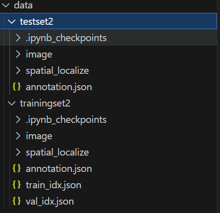
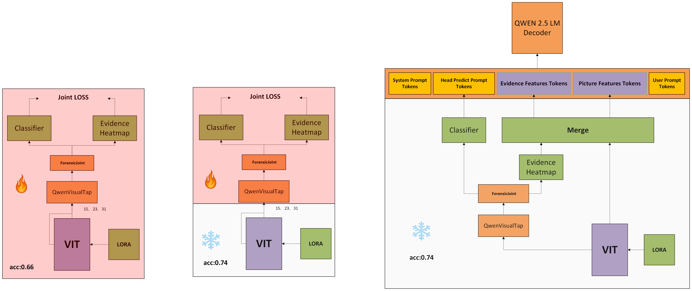
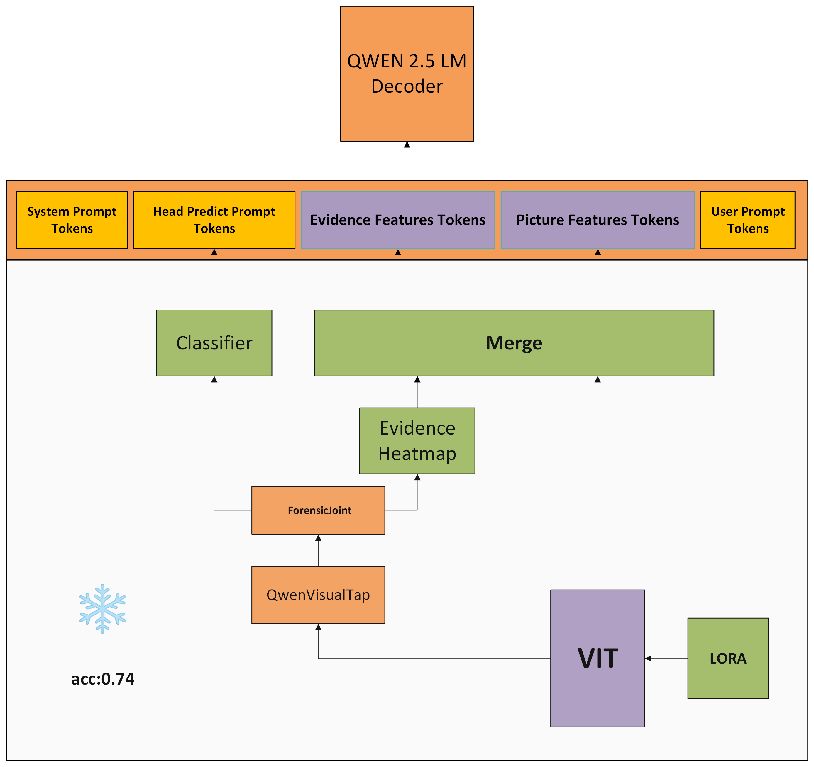

# Qwen2.5-VL LoRA Pipelines

<p align="center">
  
</p>

本仓库整理了围绕 **Qwen2.5-VL-7B-Instruct** 的多阶段 LoRA 训练、评估与推理流程，涵盖视觉骨干插入 LoRA、取中间层特征训练取证头、生成热力图以及将视觉证据融合到多模态问答输出中。



## 目录速览

| 目录 | 说明 |
| --- | --- |
| `Qwen_pretrain/` | 预训练阶段的脚本与已产出的视觉 LoRA (`lora_adapter/`) 以及取证头权重 (`head/`) |
| `Qwen_pretrain/script/` | 三个阶段的训练脚本：分类头预热、联合分类+热图、LoRA 联合微调 |
| `Qwen_code/task7_vit_lora_eval/` | Task7 评估：加载视觉 LoRA 与冻结的取证头，输出分类与热图指标 |
| `Qwen_code/task8_inference/` | Task8 推理：在 LoRA+取证头的基础上生成解释性文本与可视化证据 |
| `data/` | 存放训练/验证划分 JSON（示例为 `trainingset2/train_idx.json`, `val_idx.json`） |

## 环境准备

1. 建议使用 Python ≥ 3.10 与 PyTorch 2.1+/CUDA 12 环境。
2. 安装依赖（根据实际环境调整 CUDA 对应的 `torch` 版本）：

   ```bash
   pip install transformers==4.39.3 peft==0.10.0 accelerate==0.29.3
   pip install pillow numpy pandas scikit-learn tqdm
   ```

3. 将模型与数据放置到固定根目录（默认 `/root/autodl-tmp`）：

   ```text
   /root/autodl-tmp/
   ├── Qwen2.5-VL-7B-Instruct/        # 官方基础模型
   ├── qwen2.5-vl-lora/               # 本仓库（建议 git clone 到此）
   ├── data/
   │   ├── trainingset2/
   │   │   ├── train_idx.json
   │   │   └── val_idx.json
   │   └── testset2/annotation.json   # Task8 推理所用，可按需替换
   └── task*_*/                       # 运行脚本时生成的输出目录
   ```

   如果资源存放在其他路径，请在运行脚本时通过参数或配置文件进行覆盖。

## 标注文件格式

训练与评估脚本默认读取 JSON 列表，每个元素包含图像相对路径、可选掩码与标签。例如：

```json
[
  {
    "image_path": "trainingset2/image/xxx.jpg",
    "mask_path": "trainingset2/spatial_localize/xxx.jpg",
    "label": 1
  },
  {
    "image_path": "trainingset2/image/yyy.jpg",
    "mask_path": "1080x1920",
    "label": 0
  }
]
```

- `label` 为 1 表示伪造图像，可提供同名掩码；
- 真图像可将 `mask_path` 写为 `HxW` 字符串以指明原始尺寸；
- 所有路径均会拼接到 `data_root`（默认 `/root/autodl-tmp/data`）。

## 训练流水线

### 阶段 A：分类头预热（`Qwen_pretrain/script/warmclassification.py`）

- 冻结 Qwen2.5-VL 的视觉与语言塔，仅训练融合颈部与二分类头；
- 从固定路径 `/root/data/trainingset2/trainingset2/annotation.json` 读取样本，可通过修改脚本或软链接调整；
- 关键参数：`--epochs`、`--batch_size`、`--lr`、`--val_ratio`；
- 输出目录（默认 `outputs_clsA/`）会保存 `best_val_auc.pt` 与训练日志 CSV；
- 该阶段产生的最佳分类头将在后续阶段作为初始化与对齐基准。

运行示例：

```bash
python Qwen_pretrain/script/warmclassification.py \
  --epochs 4 --batch_size 32 --out_dir /root/autodl-tmp/taskA_cls
```

### 阶段 B：联合分类 + 热图训练（`Qwen_pretrain/script/classanddetect.py`）

- 在冻结视觉主干的前提下，联合优化分类头与热力图分支；
- 需要阶段 A 的输出（默认查找 `best_by_AUROC.pt` 与 `calibration.json`）；
- 通过 `--data_root`、`--train_ann`、`--val_ann` 指定数据；
- 评估会记录分类指标（AUROC/ACC/F1）与掩码指标（IoU/Dice），并可选保存热图可视化；
- 输出目录（默认 `outputs_joint/`）包含 `best_by_AUROC_joint.pt` 与热图快照。

示例命令：

```bash
python Qwen_pretrain/script/classanddetect.py \
  --data_root /root/autodl-tmp/data \
  --train_ann /root/autodl-tmp/data/trainingset2/train_idx.json \
  --val_ann /root/autodl-tmp/data/trainingset2/val_idx.json \
  --clsA_dir /root/autodl-tmp/taskA_cls \
  --out_dir /root/autodl-tmp/taskB_joint
```

### 阶段 C：视觉 LoRA 联合微调（`Qwen_pretrain/script/afterloradandc.py`）

- 在阶段 B 的基础上，加载视觉塔的 LoRA 适配器并继续联合训练分类头与热图；
- 依赖 `peft` 合并/加载 LoRA 权重，默认层选择 `[15, 23, 31]`；
- 参数与阶段 B 类似，额外提供 `--evi_alpha`、`--sparse_w`、`--contrast_w` 等损失权重；
- 输出目录（默认 `outputs_lora_joint/`）将生成 `best_by_AUROC_joint.pt`、`best_by_IoU_joint.pt`、阶段性 checkpoint 及评估日志。

示例命令：

```bash
python Qwen_pretrain/script/afterloradandc.py \
  --data_root /root/autodl-tmp/data \
  --train_ann /root/autodl-tmp/data/trainingset2/train_idx.json \
  --val_ann /root/autodl-tmp/data/trainingset2/val_idx.json \
  --model_path /root/autodl-tmp/Qwen2.5-VL-7B-Instruct \
  --clsA_dir /root/autodl-tmp/taskB_joint \
  --out_dir /root/autodl-tmp/taskC_lora
```

训练完成后，请将最佳权重整理到：

- `Qwen_pretrain/lora_adapter/`（LoRA 适配器目录，含 `adapter_model.safetensors` 与 `adapter_config.json`）；
- `Qwen_pretrain/head/best_by_AUROC_joint_lora.pt`（分类+热图头权重）。

## Task7：视觉 LoRA + 冻结头评估

- 脚本：`Qwen_code/task7_vit_lora_eval/vit_head_eval.py`
- 配置文件：`Qwen_code/task7_vit_lora_eval/config_eval.json`
- 功能：加载基础模型、合并视觉 LoRA、挂接冻结取证头，对验证集输出分类/热图指标与预测结果。

运行方法：

```bash
python Qwen_code/task7_vit_lora_eval/vit_head_eval.py \
  --config Qwen_code/task7_vit_lora_eval/config_eval.json
```

主要配置字段：

- `base_model_path`：Qwen2.5-VL-7B-Instruct 路径；
- `visual_lora.path` 与 `visual_lora.layers`：预训练 LoRA 权重及注入层；
- `head_checkpoint`：阶段 C 产出的取证头权重；
- `ann_eval`、`data_root`：评估数据；
- `metrics_csv`、`inference_output`：保存分类指标与逐样本预测的路径。

## Task8：多模态取证推理

<p align="center">
  
</p>

<p align="center">
  
</p>


- 脚本：`Qwen_code/task8_inference/multimodal_inference.py`
- 配置：`Qwen_code/task8_inference/config_inference.json`
- 功能：
  - 加载 Task7 的视觉与头部权重；
  - 生成真实/伪造判定、热图叠加图与解释性文本；
  - 支持多条提示模板随机采样，输出 CSV 与证据图片。

执行示例：

```bash
python Qwen_code/task8_inference/multimodal_inference.py \
  --config Qwen_code/task8_inference/config_inference.json
```

常用配置：

- `system_prompt` / `chat_system_prompt` / `user_prompt`：控制对话模板；
- `generation`：解码参数（`max_new_tokens`、`temperature`、`top_p`）；
- `output.csv` 与 `output.evidence_dir`：分别保存文本与可视化结果。

## 常见问题排查

- **路径不存在**：所有脚本默认使用 `/root/autodl-tmp` 或 `/root/data` 前缀，请根据实际部署调整参数或建立软链接。
- **显存不足**：适当降低 `--batch_size`，或在配置文件中调节 `batch_size`、`num_workers`；
- **LoRA 未注入**：Task7/Task8 在加载视觉 LoRA 时会打印注入模块名称，若日志提示未检测到 LoRA，请检查 `visual_lora.path` 路径。
- **热图为空**：验证 `classification_threshold`、`heatmap_threshold`，并确认掩码标注路径有效。

通过以上流程，可完成从视觉 LoRA 训练到解释性多模态推理的端到端 pipeline。欢迎在此基础上拓展自定义配置与任务。