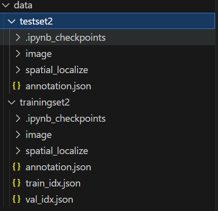
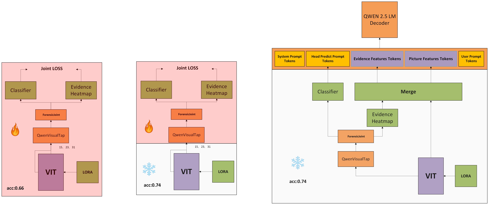
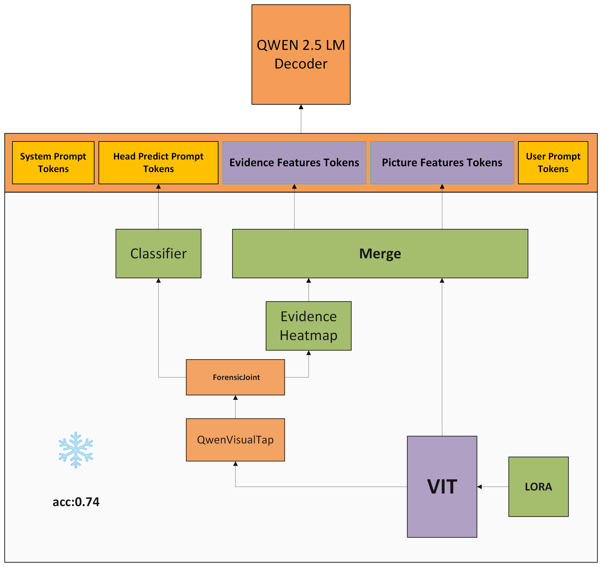

# Qwen2.5-VL LoRA Pipelines

<p align="center">
  
</p>

This repository is provided by Han Wu. 
The Output in this link: https://drive.google.com/drive/folders/1AkWA8jKgtMqnuhkp8Nrd2Llfbn0_-iAx?usp=sharing



---

## 📂 Directory Overview

| Directory | Description |
| --- | --- |
| `Qwen_pretrain/` | Scripts and outputs from the pre-training phase, including visual LoRA adapters (`lora_adapter/`) and forensic head weights (`head/`) |
| `Qwen_pretrain/script/` | Three-stage training scripts: classification-head warm-up, joint classification + heatmap training, and LoRA-based joint fine-tuning |
| `Qwen_code/task7_vit_lora_eval/` | Task 7 – Evaluation: load visual LoRA and frozen forensic head to output classification & heatmap metrics |
| `Qwen_code/task8_inference/` | Task 8 – Inference: generate explanatory text and visual evidence based on LoRA + forensic head |
| `data/` | Dataset splits in JSON format (e.g., `trainingset2/train_idx.json`, `val_idx.json`) |

---

## ⚙️ Environment Setup

1. Recommended Python ≥ 3.10 and PyTorch ≥ 2.1 with CUDA 12.  
2. Install dependencies (adjust `torch` version according to your CUDA runtime):

   ```bash
   pip install transformers==4.39.3 peft==0.10.0 accelerate==0.29.3
   pip install pillow numpy pandas scikit-learn tqdm
   ```

3. Organize model and data under a fixed root path (default: `/root/autodl-tmp`):

   ```text
   /root/autodl-tmp/
   ├── Qwen2.5-VL-7B-Instruct/        # Official base model (https://huggingface.co/Qwen/Qwen2.5-VL-7B-Instruct)
   ├── qwen2.5-vl-lora/               # This repository (recommended to git clone here)
   ├── data/
   │   ├── trainingset2/
   │   │   ├── train_idx.json
   │   │   └── val_idx.json
   │   └── testset2/annotation.json   # For Task 8 inference, can be replaced
   └── task*_*/                       # Output directories generated by scripts
   ```

   If resources are stored elsewhere, override paths via CLI arguments or config files.

---

## 🧾 Annotation File Format

Training and evaluation scripts read JSON lists where each entry contains the image path, optional mask, and label. Example:

```json
[
  {
    "image_path": "trainingset2/image/xxx.jpg",
    "mask_path": "trainingset2/spatial_localize/xxx.jpg",
    "label": 1
  },
  {
    "image_path": "trainingset2/image/yyy.jpg",
    "mask_path": "1080x1920",
    "label": 0
  }
]
```

- `label = 1` → fake image (a corresponding mask can be provided);  
- Real images may use `HxW` string for `mask_path` to specify original size;  
- All paths are concatenated with `data_root` (default `/root/autodl-tmp/data`).

---

## 🧪 Task 7 – Evaluation with Visual LoRA + Frozen Head

- **Script:** `Qwen_code/task7_vit_lora_eval/vit_head_eval.py`  
- **Config:** `Qwen_code/task7_vit_lora_eval/config_eval.json`  
- **Purpose:** Load the base model, merge LoRA, attach the frozen forensic head, and compute classification + heatmap metrics.

**Example:**
```bash
python Qwen_code/task7_vit_lora_eval/vit_head_eval.py   --config Qwen_code/task7_vit_lora_eval/config_eval.json
```

**Key Config Fields:**
- `base_model_path` – path to Qwen2.5-VL-7B-Instruct  
- `visual_lora.path` & `visual_lora.layers` – LoRA weights and injection layers  
- `head_checkpoint` – Stage C forensic-head weights  
- `ann_eval`, `data_root` – evaluation data  
- `metrics_csv`, `inference_output` – paths to save metrics and predictions

---

## 💬 Task 8 – Multimodal Forensic Inference

<p align="center">
  
</p>

<p align="center">
  
</p>

- **Script:** `Qwen_code/task8_inference/multimodal_inference.py`  
- **Config:** `Qwen_code/task8_inference/config_inference.json`  
- **Features:**  
  - Load Task 7 visual and head weights  
  - Generate real/fake decisions, heatmap overlays, and explanatory text  
  - Support random sampling of prompt templates; save CSV and visual outputs

**Example:**
```bash
python Qwen_code/task8_inference/multimodal_inference.py   --config Qwen_code/task8_inference/config_inference.json
```

**Key Configs:**
- `system_prompt`, `chat_system_prompt`, `user_prompt` – control dialogue templates  
- `generation` – decoding params (`max_new_tokens`, `temperature`, `top_p`)  
- `output.csv`, `output.evidence_dir` – paths for text and visual outputs  

---

## 🧰 Troubleshooting

- **Path not found** → Scripts assume `/root/autodl-tmp` or `/root/data` prefix. Adjust via arguments or symlinks.  
- **OOM (Out of Memory)** → Reduce `--batch_size`, or tune `batch_size` / `num_workers` in configs.  
- **LoRA not injected** → Task 7/8 logs print injected modules. If missing, check `visual_lora.path`.  
- **Empty heatmap** → Check `classification_threshold` / `heatmap_threshold` and mask annotations.  

---

With this pipeline, you can achieve an **end-to-end workflow** from visual LoRA training to **explainable multimodal inference**.  
You are encouraged to customize and extend the configurations or integrate new tasks on top of this framework.
